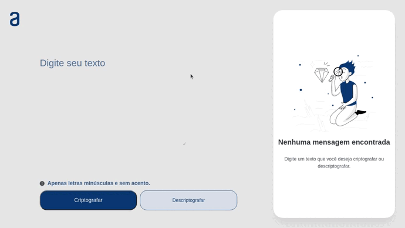

### Observação

Este repositório contem o **Projeto Text Decoder** que reúne o aprendizado desenvolvido por _[Willian Alves Batista](https://www.linkedin.com/in/willian-alves-batista-60aa6a180/)_.

# Projeto Text Decoder
### Resultado obtido:
### Deploy do Site: [Projeto Text Decoder](https://text-decoder-by-willian.netlify.app/)

####

  - Logica de programação;
  - Clean Code;

#### Tecnologias utilizadas:

  - HTML;
  - CSS;
  - JavaScript;

---

## Apresentação do Projeto

Nesse projeto é possível Criptografia e Decriptografia o texto digitado.

---

